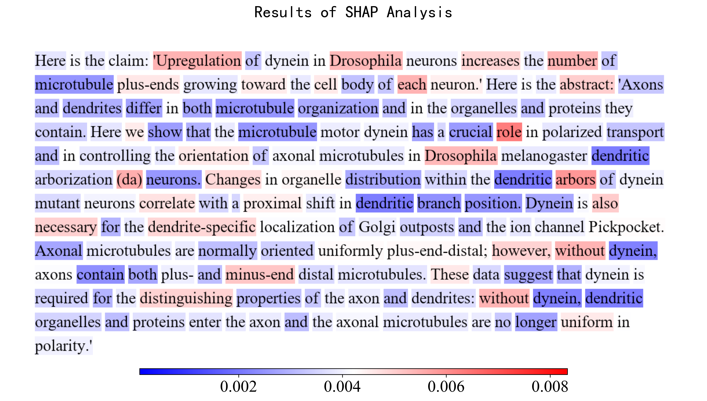
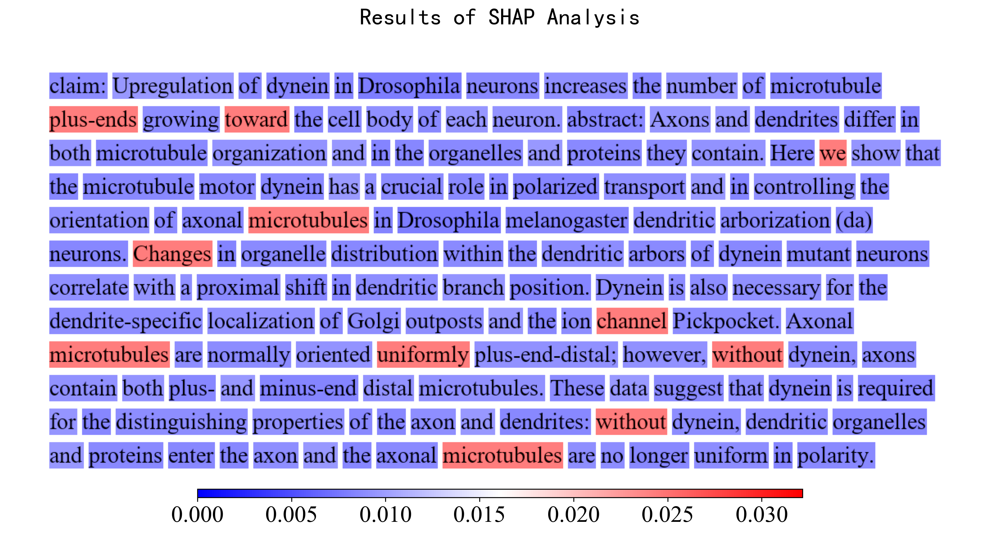

# Auto Detection of Quotation errors

This repository contains data and code for the paper [Auto Detection of Quotation errors](这里写论文链接), which is used for auto detection of quotation errors. The code and data of the paper is coming soon.

## Examples of Prompt Learning 

- Data Set Construction 
```json
{
  "messages": [
    {
      "role": "system",
      "content": "You are an expert in the medical field and are familiar with other scientific fields, and now you will receive a scientific claim and an abstract of the scientific literature. According to the given claim and abstract, infer whether the viewpoints of the abstract and the claim are consistent. If there is no clear relationship between the content of the claim and the abstract, please return NULL. Please determine whether the content of the abstract supports or contradicts the viewpoint of the claim. If it supports, return SUPPORT; if it contradicts, return CONTRADICT; if there is no clear relationship, return NULL."
    },
    {
      "role": "user",
      "content": "Here is the claim: '0-dimensional biomaterials show inductive properties.' Here is the abstract: 'Nanotechnologies are emerging platforms that could be useful in measuring, understanding, and manipulating stem cells. Examples include magnetic nanoparticles and quantum dots for stem cell labeling and in vivo tracking; nanoparticles, carbon nanotubes, and polyplexes for the intracellular delivery of genes/oligonucleotides and protein/peptides; and engineered nanometer-scale scaffolds for stem cell differentiation and transplantation. This review examines the use of nanotechnologies for stem cell tracking, differentiation, and transplantation. We further discuss their utility and the potential concerns regarding their cytotoxicity.'"
    },
    {
      "role": "assistant",
      "content": "NULL"
    }
  ]
}
```

- Data Set Construction (3-shot)
```json
{
  "messages": [
    {
      "role": "system",
      "content": "You are an expert in the medical field and are familiar with other scientific fields, and now you will receive a scientific claim and an abstract of the scientific literature. According to the given claim and abstract, infer whether the viewpoints of the abstract and the claim are consistent. If there is no clear relationship between the content of the claim and the abstract, please return NULL.Please determine whether the content of the abstract supports or contradicts the viewpoint of the claim. If it supports, return SUPPORT; if it contradicts, return CONTRADICT; if there is no clear relationship, return NULL."
    },
    {
      "role": "user",
      "content": "Here is the claim: '32% of liver transplantation programs required patients to discontinue methadone treatment in 2001.' Here is the abstract: 'ContextChronic hepatitis C is the leading cause for liver\ntransplantation in the United States. Intravenous drug use, the major\nrisk factor, accounts for approximately 60% of hepatitis C virus\ntransmission. Information from the United Network of Organ Sharing\n(UNOS) does not address substance use among liver transplantation\npatients.ObjectiveTo identify addiction-related criteria for admission to\nthe UNOS liver transplantation waiting list and posttransplantation\nproblems experienced by patients who are prescribed maintenance\nmethadone.Design, Setting, and ParticipantsMail survey of all 97 adult US\nliver transplantation programs (belonging to UNOS) in March 2000 with\ntelephone follow-up conducted in May and June 2000.Main Outcome MeasuresPrograms' acceptance and management of\npatients with past or present substance use disorder.ResultsOf the 97 programs surveyed, 87 (90%) responded. All\naccept applicants with a history of alcoholism or other addictions,\nincluding heroin dependence. Eighty-eight percent of the responding\nprograms require at least 6 months of abstinence from alcohol; 83%\nfrom illicit drugs. Ninety-four percent have addiction treatment\nrequirements. Consultations from substance abuse specialists are\nobtained by 86%. Patients receiving methadone maintenance are accepted\nby 56% of the responding programs. Approximately 180 patients\nreceiving methadone maintenance are reported to have undergone liver\ntransplantation.ConclusionsMost liver transplantation programs have established\npolicies for patients with substance use disorders. Opiate-dependent\npatients receiving opiate replacement therapy seem underrepresented in\ntransplantation programs. Little anecdotal evidence for negative impact\nof opiate replacement therapy on liver transplantation outcome was\nfound. Policies requiring discontinuation of methadone in 32% of all\nprograms contradict the evidence base for efficacy of long-term\nreplacement therapies and potentially result in relapse of previously\nstable patients.'"
    },
    {
      "role": "assistant",
      "content": "SUPPORT"
    },
    {
      "role": "user",
      "content": "Here is the claim: '1 in 5 million in UK have abnormal PrP positivity.' Here is the abstract: 'Objectives To carry out a further survey of archived appendix samples to understand better the differences between existing estimates of the prevalence of subclinical infection with prions after the bovine spongiform encephalopathy epizootic and to see whether a broader birth cohort was affected, and to understand better the implications for the management of blood and blood products and for the handling of surgical instruments. Design Irreversibly unlinked and anonymised large scale survey of archived appendix samples. Setting Archived appendix samples from the pathology departments of 41 UK hospitals participating in the earlier survey, and additional hospitals in regions with lower levels of participation in that survey. Sample 32 441 archived appendix samples fixed in formalin and embedded in paraffin and tested for the presence of abnormal prion protein (PrP). Results Of the 32 441 appendix samples 16 were positive for abnormal PrP, indicating an overall prevalence of 493 per million population (95% confidence interval 282 to 801 per million). The prevalence in those born in 1941-60 (733 per million, 269 to 1596 per million) did not differ significantly from those born between 1961 and 1985 (412 per million, 198 to 758 per million) and was similar in both sexes and across the three broad geographical areas sampled. Genetic testing of the positive specimens for the genotype at PRNP codon 129 revealed a high proportion that were valine homozygous compared with the frequency in the normal population, and in stark contrast with confirmed clinical cases of vCJD, all of which were methionine homozygous at PRNP codon 129. Conclusions This study corroborates previous studies and suggests a high prevalence of infection with abnormal PrP, indicating vCJD carrier status in the population compared with the 177 vCJD cases to date. These findings have important implications for the management of blood and blood products and for the handling of surgical instruments.'"
    },
    {
      "role": "assistant",
      "content": "CONTRADICT"
    },
    {
      "role": "user",
      "content": "Here is the claim: '0-dimensional biomaterials lack inductive properties.' Here is the abstract: 'Nanotechnologies are emerging platforms that could be useful in measuring, understanding, and manipulating stem cells. Examples include magnetic nanoparticles and quantum dots for stem cell labeling and in vivo tracking; nanoparticles, carbon nanotubes, and polyplexes for the intracellular delivery of genes/oligonucleotides and protein/peptides; and engineered nanometer-scale scaffolds for stem cell differentiation and transplantation. This review examines the use of nanotechnologies for stem cell tracking, differentiation, and transplantation. We further discuss their utility and the potential concerns regarding their cytotoxicity.'"
    },
    {
      "role": "assistant",
      "content": "NULL"
    },
    {
      "role": "user",
      "content": "Here is the claim: '0-dimensional biomaterials show inductive properties.' Here is the abstract: 'Nanotechnologies are emerging platforms that could be useful in measuring, understanding, and manipulating stem cells. Examples include magnetic nanoparticles and quantum dots for stem cell labeling and in vivo tracking; nanoparticles, carbon nanotubes, and polyplexes for the intracellular delivery of genes/oligonucleotides and protein/peptides; and engineered nanometer-scale scaffolds for stem cell differentiation and transplantation. This review examines the use of nanotechnologies for stem cell tracking, differentiation, and transplantation. We further discuss their utility and the potential concerns regarding their cytotoxicity.'"
    },
    {
      "role": "assistant",
      "content": "NULL"
    }
  ]
}
```
## Examples of LLM fine-tuning
- qwen-7B
```json
{
  "instruction": "You are an expert in the field of medicine and are also knowledgeable in other scientific fields. You will now receive a piece of text that contains a scientific claim, which ends at (end1), and also includes an abstract of a scientific paper, which ends at (end2). You will also receive an option (SUPPORT indicates the abstract supports the claim, CONTRADICT indicates the abstract contradicts the claim, and NULL indicates there is no clear support or contradiction between the abstract and the claim) to represent the relationship between the abstract and the claim. Please determine the relationship between the claim and the abstract in the text and output the correct option.",
  "input": "claim:0-dimensional biomaterials show inductive properties.(end1)abstract:Nanotechnologies are emerging platforms that could be useful in measuring, understanding, and manipulating stem cells. Examples include magnetic nanoparticles and quantum dots for stem cell labeling and in vivo tracking; nanoparticles, carbon nanotubes, and polyplexes for the intracellular delivery of genes/oligonucleotides and protein/peptides; and engineered nanometer-scale scaffolds for stem cell differentiation and transplantation. This review examines the use of nanotechnologies for stem cell tracking, differentiation, and transplantation. We further discuss their utility and the potential concerns regarding their cytotoxicity.(end2),Category:['SUPPORT', 'CONTRADICT', 'NULL']",
  "output": "NULL"
}

```
- deepseek-r1-distill-llama-8b
```json
{
  "prompt": "You are an expert in the medical field and are familiar with other scientific fields, and now you will receive a  scientific claim and an abstract of the scientific literature. According to the given claim and abstract, infer whether the viewpoints of the abstract and the claim are consistent. If there is no clear relationship between the content of the claim and the abstract, please return NULL.Please determine whether the content of the abstract supports or contradicts the viewpoint of the claim. If it supports, return SUPPORT; if it contradicts, return CONTRADICT; if there is no clear relationship, return NULL. Here is the claim: '0-dimensional biomaterials show inductive properties.' Here is the abstract: 'Nanotechnologies are emerging platforms that could be useful in measuring, understanding, and manipulating stem cells. Examples include magnetic nanoparticles and quantum dots for stem cell labeling and in vivo tracking; nanoparticles, carbon nanotubes, and polyplexes for the intracellular delivery of genes/oligonucleotides and protein/peptides; and engineered nanometer-scale scaffolds for stem cell differentiation and transplantation. This review examines the use of nanotechnologies for stem cell tracking, differentiation, and transplantation. We further discuss their utility and the potential concerns regarding their cytotoxicity.'",
  "completion": "NULL"
}
```

## Examples of SHAP



## API Configuration

API keys are managed via `config/api_keys.json`. Create this file with your credentials:

```json
{
  "qwen": {
    "api_key": "your-qwen-api-key"
  }
}
```

## RAG Usage

### Overview

RAG (Retrieval-Augmented Generation) provides two retrieval methods for claim verification:

- **Hybrid Dense-Sparse Retrieval**: Combines BM25 keyword search with PubMedBERT semantic search using Reciprocal Rank Fusion
- **HyDE Retrieval**: Uses LLM-generated hypotheses to enhance document retrieval

### Running RAG Inference

```bash
cd rag

# Run single fold with specific method
python rag_inference.py --dataset scifact --fold 1 --method hybrid
python rag_inference.py --dataset scifact --fold 1 --method hyde
python rag_inference.py --dataset scifact --fold 1 --method both

# Run all folds
python rag_inference.py --dataset scifact --method both

# Run smith dataset
python rag_inference.py --dataset smith --fold 1 --method both
```

### Evaluating RAG Results

```bash
python evaluate.py
```

### Output Files

- `output_*.jsonl`: Model predictions
- `progress_*.json`: Checkpoint files for resume capability

## Model Fine-tuning

The fine-tuning code is located in the code directory. Please deploy the model and conduct fine-tuning on your own as needed.
