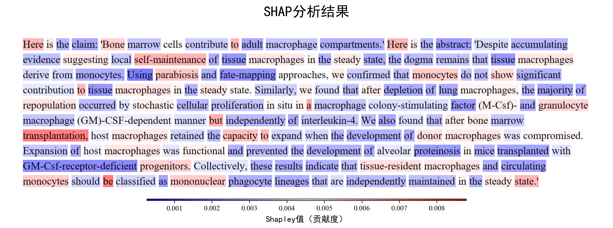

# Auto Detection of Quotation errors

This repository contains data and code for the paper [Auto Detection of Quotation errors](这里写论文链接), which is used for auto detection of quotation errors. The code and data of the paper is coming soon.

## Examples of Prompt Learning 

- Data Set Construction A
```json
{
  "messages": [
    {
      "role": "system",
      "content": "You are an expert in the medical field and are familiar with other scientific fields, and now you will receive a scientific claim and an abstract of the scientific literature. According to the given claim and abstract, infer whether the viewpoints of the abstract and the claim are consistent. If there is no clear relationship between the content of the claim and the abstract, please return NULL. Please determine whether the content of the abstract supports or contradicts the viewpoint of the claim. If it supports, return SUPPORT; if it contradicts, return CONTRADICT; if there is no clear relationship, return NULL."
    },
    {
      "role": "user",
      "content": "Here is the claim: '0-dimensional biomaterials show inductive properties.' Here is the abstract: 'Nanotechnologies are emerging platforms that could be useful in measuring, understanding, and manipulating stem cells. Examples include magnetic nanoparticles and quantum dots for stem cell labeling and in vivo tracking; nanoparticles, carbon nanotubes, and polyplexes for the intracellular delivery of genes/oligonucleotides and protein/peptides; and engineered nanometer-scale scaffolds for stem cell differentiation and transplantation. This review examines the use of nanotechnologies for stem cell tracking, differentiation, and transplantation. We further discuss their utility and the potential concerns regarding their cytotoxicity.'"
    },
    {
      "role": "assistant",
      "content": "NULL"
    }
  ]
}
```

- Data Set Construction B
```json
{
  "messages": [
    {
      "role": "system",
      "content": "Please obey the following: With a specific abstract, please make an estimation whether the abstract SUPPORTS, CONTRADICTS, or if there is NOT_ENOUGH_INFO to determine. You must choose SUPPORTS or CONTRADICTS or NOT_ENOUGH_INFO. Please return your answer as only the capitalized token, as well as an explanation or rationale for the answer. Please display the answer and the reason for choosing the answer in your reply, separated by ***."
    },
    {
      "role": "user",
      "content": "Claim: {0-dimensional biomaterials show inductive properties.} Abstract: {Nanotechnologies are emerging platforms that could be useful in measuring, understanding, and manipulating stem cells. Examples include magnetic nanoparticles and quantum dots for stem cell labeling and in vivo tracking; nanoparticles, carbon nanotubes, and polyplexes for the intracellular delivery of genes/oligonucleotides and protein/peptides; and engineered nanometer-scale scaffolds for stem cell differentiation and transplantation. This review examines the use of nanotechnologies for stem cell tracking, differentiation, and transplantation. We further discuss their utility and the potential concerns regarding their cytotoxicity.}"
    },
    {
      "role": "assistant",
      "content": "NOT_ENOUGH_INFO *** The abstract discusses the application of 0-dimensional materials (e.g., nanoparticles, quantum dots) in stem cell research, particularly in labeling, delivery, and differentiation support. However, it does not mention whether these materials exhibit inductive properties. Therefore, there is not enough information to determine if the claim is supported or contradicted."
    }
  ]
}
```
## Examples of LLM fine-tuning
- qwen-7B
```json
{
  "instruction": "You are an expert in the field of medicine and are also knowledgeable in other scientific fields. You will now receive a piece of text that contains a scientific claim, which ends at (end1), and also includes an abstract of a scientific paper, which ends at (end2). You will also receive an option (SUPPORT indicates the abstract supports the claim, CONTRADICT indicates the abstract contradicts the claim, and NULL indicates there is no clear support or contradiction between the abstract and the claim) to represent the relationship between the abstract and the claim. Please determine the relationship between the claim and the abstract in the text and output the correct option.",
  "input": "claim:0-dimensional biomaterials show inductive properties.(end1)abstract:Nanotechnologies are emerging platforms that could be useful in measuring, understanding, and manipulating stem cells. Examples include magnetic nanoparticles and quantum dots for stem cell labeling and in vivo tracking; nanoparticles, carbon nanotubes, and polyplexes for the intracellular delivery of genes/oligonucleotides and protein/peptides; and engineered nanometer-scale scaffolds for stem cell differentiation and transplantation. This review examines the use of nanotechnologies for stem cell tracking, differentiation, and transplantation. We further discuss their utility and the potential concerns regarding their cytotoxicity.(end2),Category:['SUPPORT', 'CONTRADICT', 'NULL']",
  "output": "NULL"
}

```
- deepseek-r1-distill-llama-8b
```json
{
  "prompt": "You are an expert in the medical field and are familiar with other scientific fields, and now you will receive a  scientific claim and an abstract of the scientific literature. According to the given claim and abstract, infer whether the viewpoints of the abstract and the claim are consistent. If there is no clear relationship between the content of the claim and the abstract, please return NULL.Please determine whether the content of the abstract supports or contradicts the viewpoint of the claim. If it supports, return SUPPORT; if it contradicts, return CONTRADICT; if there is no clear relationship, return NULL. Here is the claim: '0-dimensional biomaterials show inductive properties.' Here is the abstract: 'Nanotechnologies are emerging platforms that could be useful in measuring, understanding, and manipulating stem cells. Examples include magnetic nanoparticles and quantum dots for stem cell labeling and in vivo tracking; nanoparticles, carbon nanotubes, and polyplexes for the intracellular delivery of genes/oligonucleotides and protein/peptides; and engineered nanometer-scale scaffolds for stem cell differentiation and transplantation. This review examines the use of nanotechnologies for stem cell tracking, differentiation, and transplantation. We further discuss their utility and the potential concerns regarding their cytotoxicity.'",
  "completion": "NULL"
}
```

## Examples of SHAP





